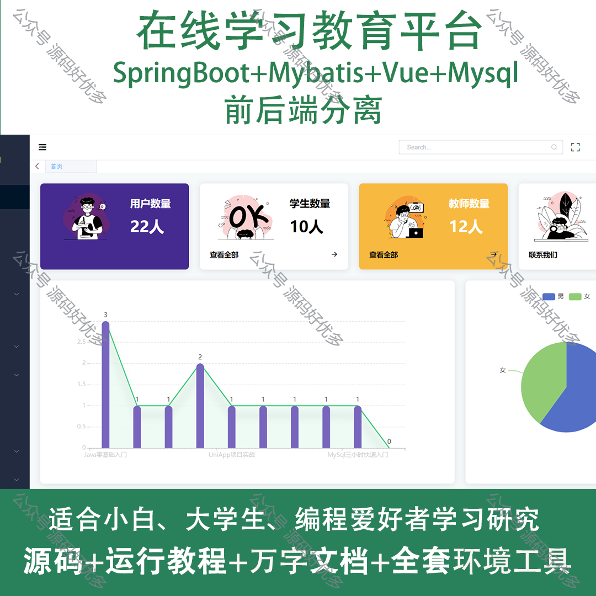
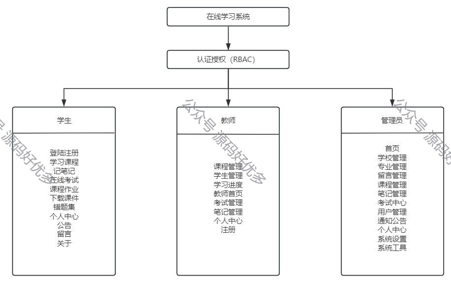
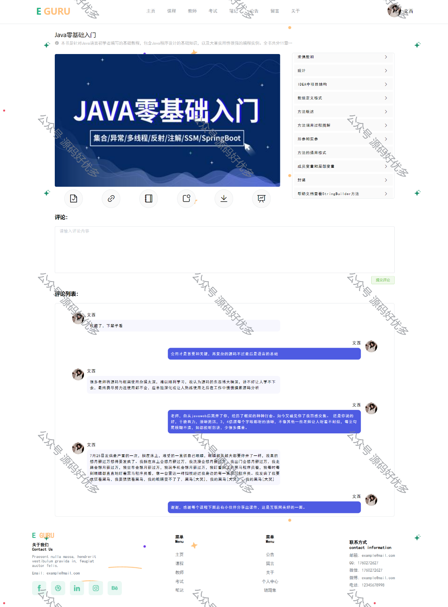
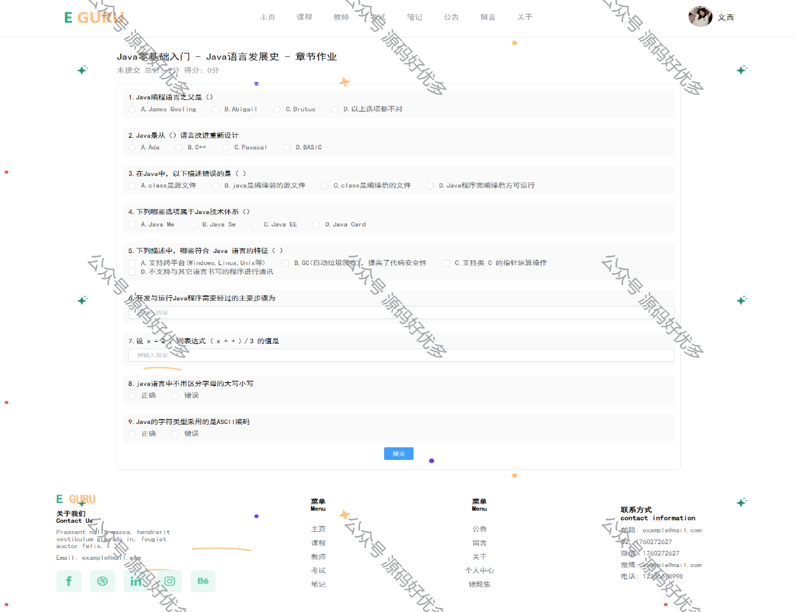
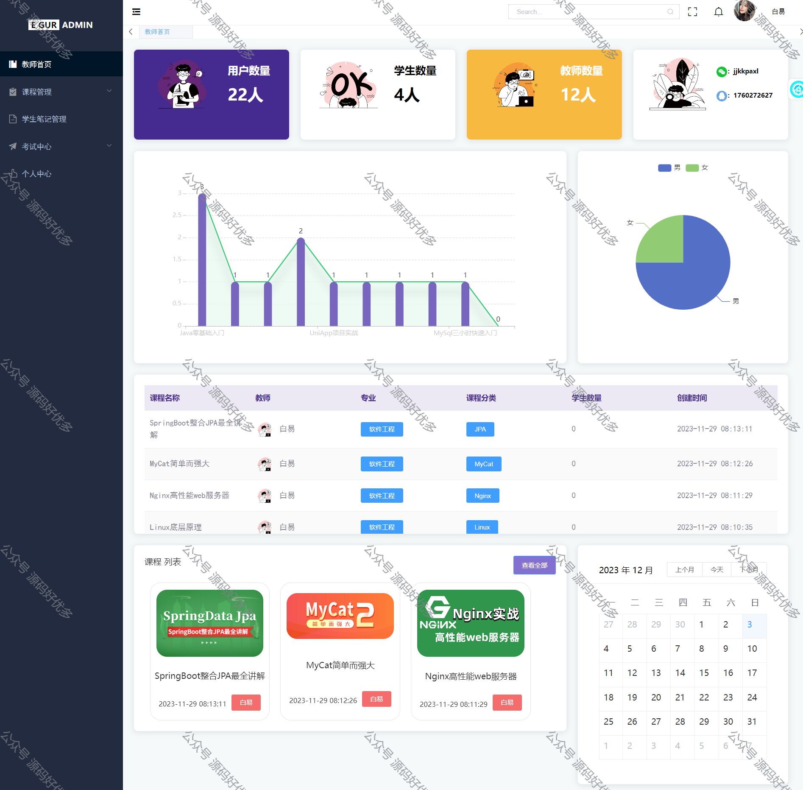
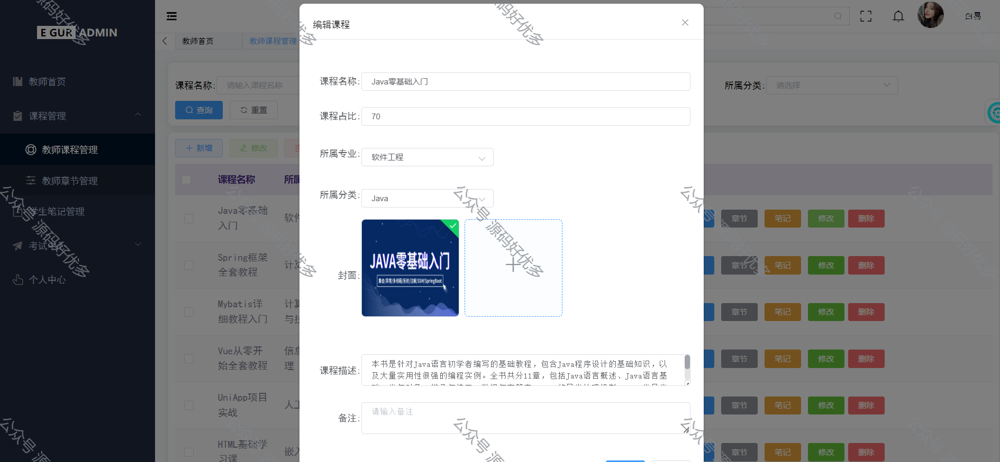
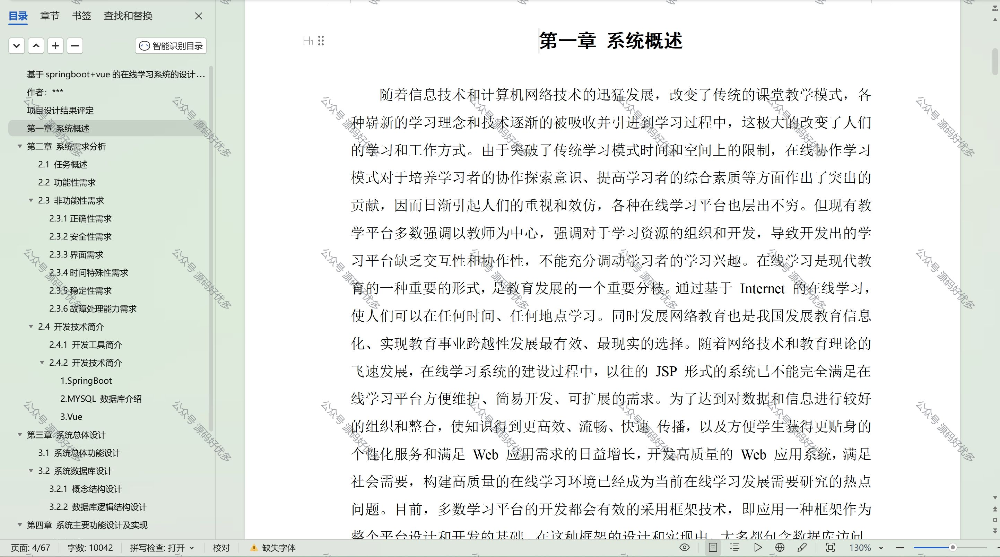

 
## 查看主页获取源码

> **作者介绍**： **✌**全网粉丝10W+本平台特邀作者、博客专家、CSDN新星计划导师、java领域优质创作者,博客之星、掘金/华为云/阿里云/InfoQ等平台优质作者、专注于项目实战 **✌**

  

### 一、作品包含

源码+数据库+设计文档万字+时序图+全套环境和工具资源+部署教程

### 二、项目技术

前端技术：Html、Css、Js、Vue、Element-ui

数据库：MySQL

后端技术：Java、Spring Boot、MyBatis

  

### 三、运行环境

开发工具：IDEA

数据库：MySQL8.0

数据库管理工具：Navicat10以上版本

环境配置软件： JDK1.8+Maven3.6.3

前端Nodejs：12

### 四、项目介绍
项目编号：springbootA128

在线学习教育平台，作为数字化时代的教育创新成果，为广大学习者提供了一个便捷、高效、个性化的学习环境。它打破了传统教育的时空限制，使得用户无论身处何地，都能通过互联网享受到优质的教育资源，实现自我提升和终身学习。平台汇聚了众多优秀的教师和教育机构，提供多样化的课程内容，满足不同年龄段和职业背景的学习需求，助力我国教育事业的发展。

系统分为管理员、学生、教师
管理员的功能：首页、学校管理、专业管理、留言管理、课程管理、笔记管理、考试中心、用户管理、通知公告、个人中心、系统设置、系统工具。
教师的功能：课程管理、学生管理、学习进度、教师首页、考试管理、笔记管理、个人中心和注册。
学生的功能：登陆注册、学习课程、记笔记、在线考试、课程作业、下载课件、错题集、个人中心、公告、留言、关于。

### 五、运行截图

  
